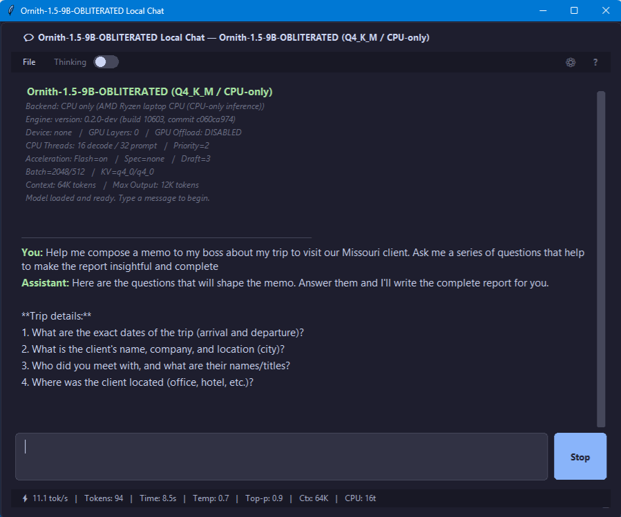

<p align="center">
  
</p>

<p align="center">
  <strong>Local AI packaged like an application instead of a science project.</strong>
</p>

<p align="center">
  One model. One quant. One runtime. One optimized recipe. Simple.
</p>

<p align="center">
  
</p>

# ThumbLLM

**ThumbLLM turns open-weight language models into portable, preconfigured local AI applications.**

Instead of installing a model manager, choosing a quantization, configuring llama.cpp, tuning inference flags, setting up an API, and figuring out what works on your hardware, each ThumbLLM release packages a specific **known-good configuration**.

```text
Model
+ Quantization
+ Runtime
+ Hardware target
+ Tested inference recipe
+ Desktop chat
+ Local API
= ThumbLLM
```

> **Download it. Launch it. Run the model locally.**

If the required model is not already present, ThumbLLM can download the expected GGUF and verify it. Once the model is available, inference runs on your own hardware without requiring a cloud AI service.

---

## Why ThumbLLM?

Running a local LLM is easier than it used to be.

Running one **well** can still require understanding:

```text
GGUF quantization
llama.cpp versions
CPU threads
GPU offload
CUDA / ROCm / Vulkan / MLX
KV cache
Flash Attention
context sizes
batch sizes
speculative decoding
hardware-specific quirks
```

ThumbLLM takes a different approach.

A release effectively says:

> **We tested this model, with this quantization, on this runtime, for this hardware, using these settings.**

The inference recipe becomes part of the application.

ThumbLLM is therefore **not intended to be another general-purpose model manager**.

A model manager gives you thousands of models and hundreds of settings.

ThumbLLM gives you a model that has already been configured for a specific job and hardware target.

---

# Two Interfaces. One Local Model.

Every ThumbLLM build is designed to make the same model available to both **people** and **software**.

## 💬 Built-In Desktop Chat

Launch ThumbLLM and interact with the model directly.

Depending on the build, the interface can provide:

* streaming responses
* generation statistics
* tokens-per-second measurements
* reasoning/thinking display
* context management
* hardware and runtime information
* startup diagnostics
* automatic model detection and download
* model checksum verification

For many users, the built-in chat is all they need.

## 🔌 OpenAI-Compatible Local API

ThumbLLM can also expose the same running model through a local OpenAI-compatible endpoint.

```text
Application / Agent / Script
          |
          v
 http://127.0.0.1:PORT/v1
          |
          v
       ThumbLLM
          |
          v
       llama.cpp
          |
          v
         LLM
```

This allows coding tools, agents, document processors, RAG systems, automation scripts, custom applications, and other AI software to use the model as a local backend.

The chat makes ThumbLLM useful to a person.

**The API makes ThumbLLM useful to software.**

---

# Local Model Fleets

Multiple ThumbLLM instances can run simultaneously if enough RAM or VRAM is available.

For example:

```text
                    Local Agent
                        |
                   Model Router
                   /          \
                  v            v
          localhost:8081   localhost:8082
                |                |
                v                v
          Small Fast Model   Larger Model
```

One model might handle classification, extraction, routing, or simple tool calls while another handles more difficult reasoning or generation.

This makes architectures such as these possible entirely on local hardware:

```text
Fast model + smart model
Coding model + general model
Router model + specialist models
CPU model + GPU model
Reasoning model + extraction model
```

ThumbLLM turns individual models into reusable local AI services.

---

# Portable and Offline

The **Thumb** in ThumbLLM is intentional.

A ThumbLLM executable, its runtime, and its model can potentially travel together on removable storage.

```text
USB Drive
│
├── ThumbLLM.exe
├── model.gguf
└── runtime/
```

Plug the drive into a compatible computer, launch ThumbLLM, and run the model.

Once the required model is present, ThumbLLM does not need a cloud inference provider.

That makes it useful on:

* laptops and workstations
* airplanes and remote sites
* secure or restricted networks
* field systems and laboratories
* machines with unreliable internet access
* offline or air-gapped environments

The goal is not merely to make the **model weights** portable.

It is to make the **working inference environment** portable.

---

# Local by Design

Local inference provides several practical benefits.

### Privacy

Prompts, source code, documents, notes, and other inputs do not need to be sent to a remote inference provider.

### Availability

The model can keep working when internet access is unavailable or unreliable.

### Cost

Once you own the hardware, generating another thousand tokens does not create another cloud API bill.

### Control

The model, runtime version, quantization, configuration, and API all remain under your control.

Local inference does not solve every security problem, but it removes remote model inference from the dependency chain.

---

# Known-Good Recipes

Configuration can dramatically affect local model performance.

During testing of an **Ornith-1.5-9B-OBLITERATED Q4_K_M** CPU build, for example:

```text
--threads 9
--threads-batch 12
```

produced roughly:

```text
9 tok/s
```

while allowing llama.cpp to determine the topology automatically:

```text
--threads 0
--threads-batch 0
```

produced roughly:

```text
13 tok/s
```

Same model.

Same quantization.

Same runtime.

Same computer.

Approximately **44% faster decode**.

That is the kind of knowledge ThumbLLM is designed to capture and preserve.

Each interesting ThumbLLM build can therefore have a documented **recipe** containing its model, quantization, llama.cpp version, backend, settings, hardware target, and measured performance.

The user does not have to rediscover the configuration.

---

# Reproducible Local AI

A ThumbLLM release can freeze the entire working environment:

```text
Model
Quantization
Runtime
Runtime version
Configuration
Application
```

This helps avoid **runtime drift**.

A model that works well with one llama.cpp build may behave or perform differently months later.

ThumbLLM treats the runtime and configuration as part of the release.

If a newer llama.cpp build introduces a significant performance improvement, that can become a **new ThumbLLM release** rather than silently changing an existing working configuration.

This makes ThumbLLM useful for:

```text
reproducible benchmarks
experimentation
demonstrations
offline deployments
long-term archives
stable workflows
```

---

# Hardware-Specific Builds

There is no assumption that one executable is optimal for every computer.

ThumbLLM builds may target:

| Backend    | Typical Hardware                                    |
| ---------- | --------------------------------------------------- |
| **CPU**    | AMD Ryzen, Threadripper, EPYC, Intel Core/Xeon      |
| **CUDA**   | NVIDIA GeForce, RTX PRO and data-center GPUs        |
| **ROCm**   | Supported AMD Radeon, Radeon PRO, APUs and Instinct |
| **Vulkan** | Cross-vendor GPU acceleration                       |
| **MLX**    | Apple Silicon                                       |

Planned operating systems and architectures include:

```text
Windows   x64 / arm64
Linux     x64 / arm64
macOS     arm64
```

Not every model will receive every build.

Releases depend on hardware availability, runtime support, model compatibility, measured performance, and community interest.

---

# One Model, Multiple Editions

The same model may have several ThumbLLM releases because different hardware benefits from different inference strategies.

For example:

```text
ThumbLLM-Ornith-1.5-9B-Q4_K_M-CPU-Win-x64
ThumbLLM-Ornith-1.5-9B-Q4_K_M-Vulkan-Win-x64
ThumbLLM-Ornith-1.5-9B-Q4_K_M-ROCm-Win-x64
ThumbLLM-Ornith-1.5-9B-Q4_K_M-CUDA-Win-x64
ThumbLLM-Ornith-1.5-9B-Q4_K_M-MLX-Mac-arm64
```

The model may be similar.

The optimized inference recipe is not.

---

# What Can You Use It For?

Because ThumbLLM provides both chat and an API, a local model can become far more than a chatbot.

Typical uses include:

* private chat and writing
* local coding assistants
* document summarization and extraction
* structured JSON generation
* local RAG
* research and analysis
* automation
* local agents
* batch processing
* model experimentation
* multi-model routing
* dedicated local AI servers

An open model can become a **classifier, parser, router, reasoning engine, code generator, document processor, or agent backend**.

ThumbLLM packages that capability as a reproducible application.

---

# Release Naming

ThumbLLM releases use descriptive filenames so you can tell what an executable targets before running it.

```text
ThumbLLM-[Model]-[Quant]-[Backend]-[OS]-[Arch]-v[Version]
```

Example:

```text
ThumbLLM-Ornith-1.5-9B-OBLITERATED-Q4_K_M-CPU-Win-x64-v1.6.1.exe
```

A release should answer these questions immediately:

```text
What model is this?
What quantization is it?
What runtime/backend does it use?
What hardware does it target?
What operating system does it run on?
What tested inference recipe does it contain?
```

---

# The Bigger Idea

ThumbLLM is built around a simple premise:

> **Open-weight models are becoming software components.**

Instead of one enormous model handling every task, a local AI system may eventually use several specialized models:

```text
                     LOCAL AI SYSTEM

              ┌──────────────────────┐
              │     Agent / App      │
              └──────────┬───────────┘
                         │
                    Local Router
          ┌──────────────┼──────────────┐
          │              │              │
          v              v              v
      Fast Model     Smart Model    Specialist
          │              │              │
          v              v              v
      ThumbLLM       ThumbLLM        ThumbLLM
          │              │              │
          └──────────────┼──────────────┘
                         │
                    Your Hardware
```

Different models.

Different strengths.

Different runtimes.

One local machine.

ThumbLLM is an attempt to make those models easier to **package, preserve, distribute, and use**.

---

# In One Sentence

> **ThumbLLM turns an open-weight language model into a portable, preconfigured local AI application with built-in chat and an OpenAI-compatible API.**

### **Local AI, packaged like software.**
